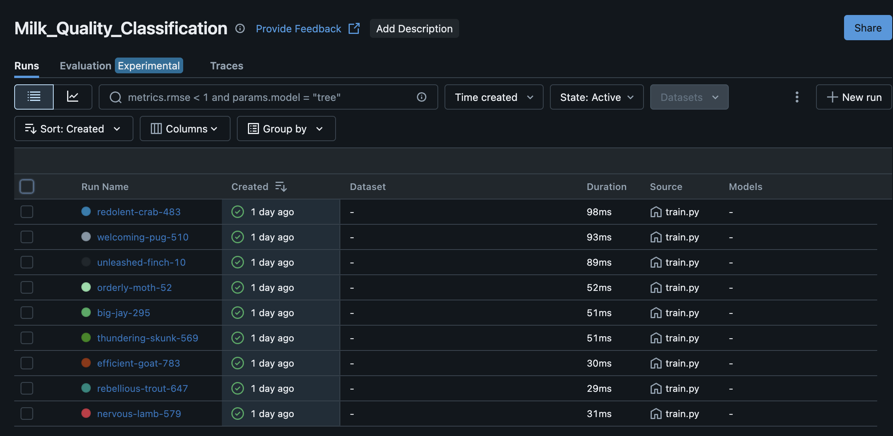
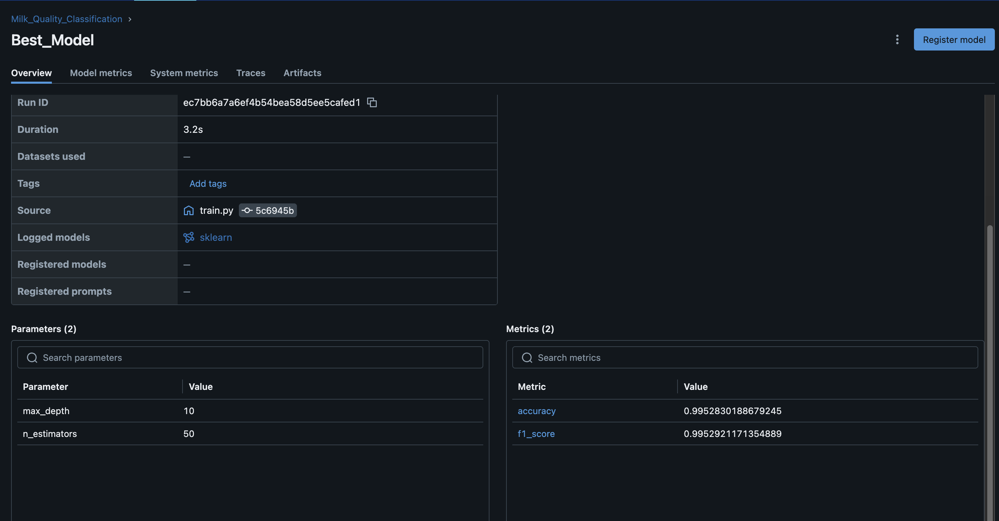
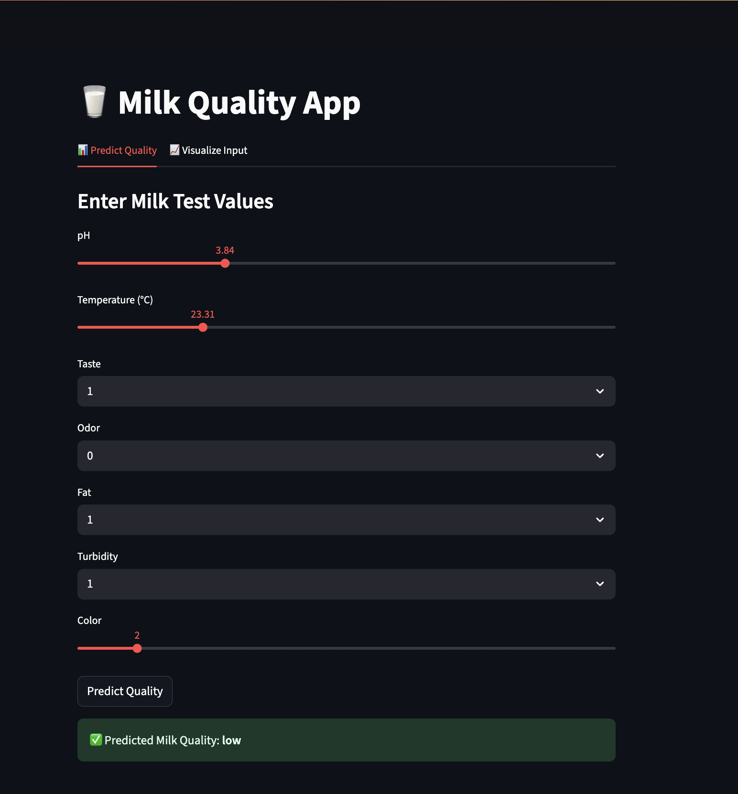
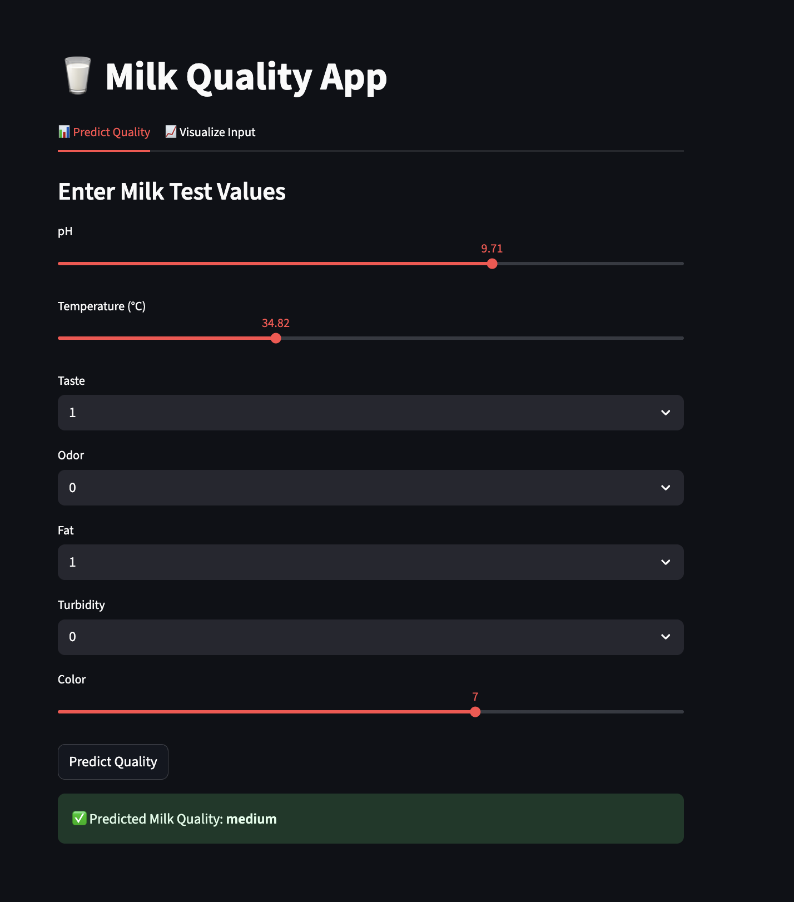
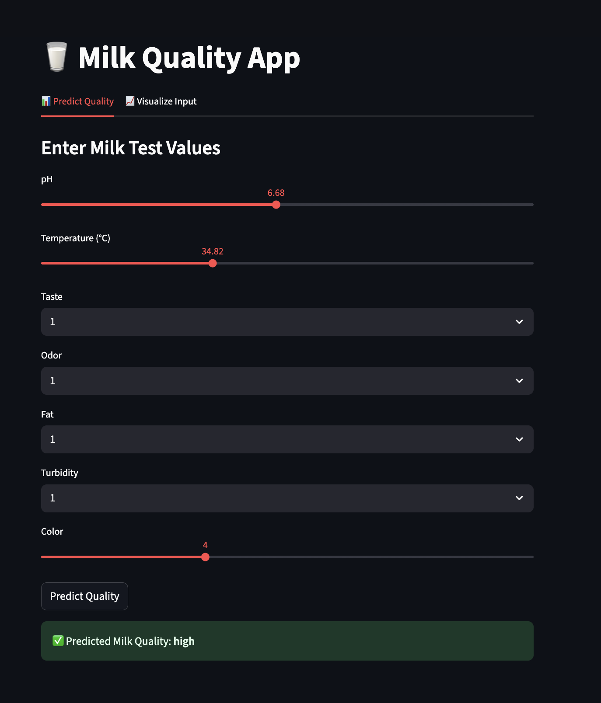
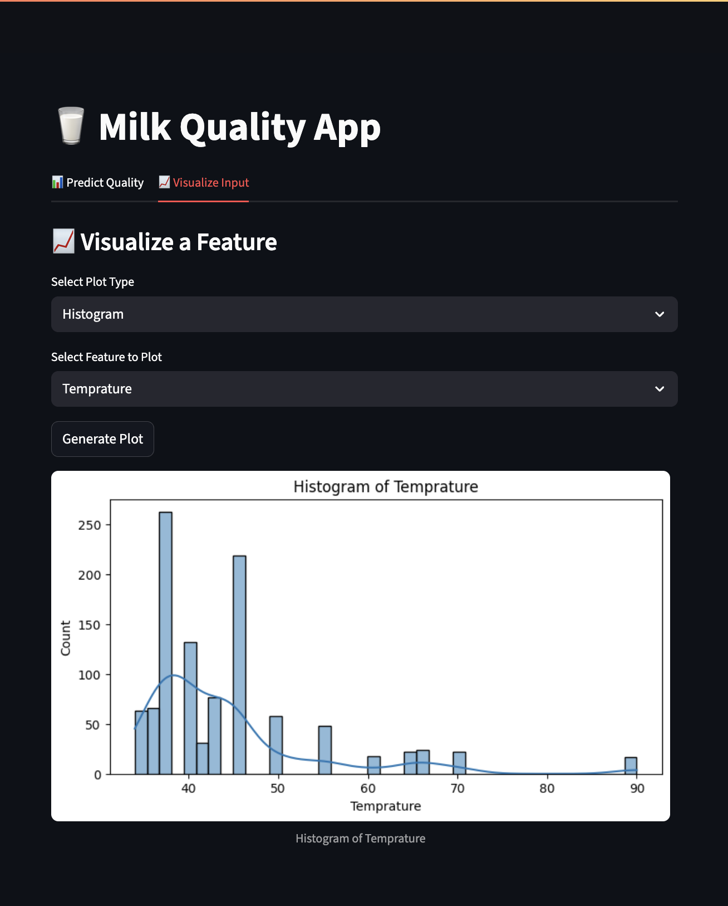

# 🥛 Milk Quality Prediction - MLOps Project

Milk Quality Prediction is a machine learning-based project that classifies milk into Low, Medium, or High quality based on measurable physical and chemical properties like pH, Temperature, Taste, Odor, Fat, Turbidity, and Color.

This end-to-end solution integrates:
- Model training with MLflow tracking
- An API backend using FastAPI
- A user-friendly Streamlit interface for predictions and data visualization
- Full Docker-based containerization for easy deployment

It demonstrates practical MLOps workflows on a real-world use case from the food quality assurance domain.

---

## 📁 Project Structure

```
milk-quality-mlops/
├── app/
│   ├── main.py                 # FastAPI backend
│   ├── streamlit_app.py        # Streamlit frontend
│   ├── visualization.py        # Matplotlib + seaborn plots
├── models/
│   └── model.pkl               # Trained ML model
│   └── label_encoder.pkl       # label encoder for the target feature
├── data/
│   └── milknew.csv           # Raw dataset
├── train.py                    # Training script + MLflow logging
├── requirements.txt            # Python dependencies
├── Dockerfile                  # For containerization
├── README.md                   # Project documentation
```

---

## 📊 Dataset Overview

- **Source**: Manually collected milk quality metrics  
- **Target Variable**: `Grade` (Low, Medium, High)  
- **Features**:
  - `pH`
  - `Temperature`
  - `Taste`
  - `Odor`
  - `Fat`
  - `Turbidity`
  - `Color`

---

## ⚙️ Setup Instructions (Local)

### 1. 📦 Clone the Repository

```bash
git clone https://github.com/pranavsrinivas29/Milk-Quality-Prediction.git
cd milk-quality-mlops
```

### 2. 🐍 Create and Activate Virtual Env (optional)

```bash
python -m venv venv #(virtual environment name)
source venv/bin/activate   # On Windows: venv\Scripts\activate
```

### 3. 📥 Install Requirements

```bash
pip install -r requirements.txt
```

---

## 🏋️‍♂️ Train Model with MLflow Tracking

```bash
python train.py
```

This:
- Trains a Random Forest with hyperparameter search  
- Logs parameters, metrics, and model artifacts to MLflow

### 🔍 Launch MLflow UI

```bash
mlflow ui
```
---

## 🚀 Run Locally Without Docker

### 1. Hyperparameter Tuning using MLFlow
```bash
python train.py
```

#### Launch MLflow UI
```bash
mlflow ui
```
Open the server link that appears in terminal
Following are the MLFlow UI Images


### 2. 🔥 Start FastAPI Backend

```bash
uvicorn app.main:app --reload --port 8000
```

Visit: server link that appears in terminal
Following are the FAST API testing Images


### 3. 🖼 Start Streamlit UI

```bash
streamlit run app/streamlit_app.py
```

Visit: server link that appears in terminal

Following are the UI Images





---

## 🐳 Docker Containerization

### 1. 🛠 Build Docker Image

```bash
docker build -t milk-quality-app .
```

### 2. 🚀 Run Docker Container

```bash
docker run --name milk-container -p 8000:8000 -p 8501:8501 milk-quality-app
```
---

## 🧪 Features in Streamlit UI

- **Predict** tab:
  - Input sliders for all features
  - Submit to FastAPI `/predict`
  - Output: Predicted milk quality

- **Visualize** tab:
  - Choose plot type: Histogram, Box Plot, Violin Plot
  - Choose feature: e.g., pH, Temperature
  - Submit to FastAPI `/plot` and show dynamic plot

---

## ✅ Tech Stack

- `Python`  
- `scikit-learn`  
- `FastAPI`  
- `Streamlit`  
- `MLflow`  
- `Docker`  
- `matplotlib`, `seaborn`

---


